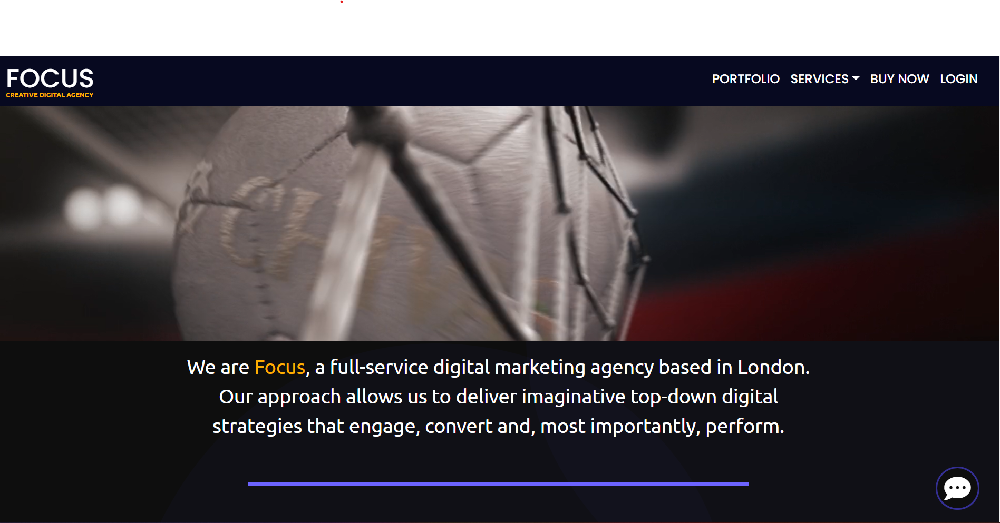

<h1 style="color:#fdad00;font-weight:700" align="center">FOCUS WEBSITE</h1>

*This is the README file for FOCUS website. You will find here a bunch of information regarding the User Experience Design, the business and users needs and the code.*

Focus is a creative digital company. They product video and photo content for digital platform. They create some marketing digital strategy for their clients and finally they can take care of the media diffusion and social media management. 

Focus Website is an application that gives the users a good understanding of what Focus is all about. 
The user will have the opportunity to see their work through a portfolio and some images/videos galleries displayed on the website.  
The users must understand what Focus is about in the first few seconds after they arrived on the website.

The main goal during the user’s visit is for they to contact the company. TO reach this goal the website is implatemented with some contact links, contant form, call-to-action buton etc.

The website have all the information the users need with a minimal design, easy to understand and easy to navigate.

[Check out the webste here.](https://###)

# User Experience

# *Business needs
        
        The two mains goals for the users during their visit are to contact the company and also to purchase their products. The others goals are showing the company's work, answer any question the users could have direcly on the website.  

# * User's needs
        
        The users want to see the company's work. They also want to understand rapidly what they are doing and how they are doing it. Users want to have as much information as possible regarding the products they want to buy and finally they want to be able to contact the company easily.

# * Website requirements
        
        In order to achieve the businees and user's need the website have some requirements:

            - portfolio
            - contact form/links
            - list of services
            - catchy design

# * Website Structure
        
    Focus website will be divided into 4 mains categories:
        - **Demonstration**: The website shows the users what the company does and how it does it. 
        - **Information**: The website gives the users all the answer/information they need.
        - **Communication**: The users can communicate with the company easily.

# * Usage Scenario
        
        lorem lispum vkavka

<h1 style="color:#fdad00;font-weight:500">Design</h1>

# * Wireframes

        The mains colors used on the website are dark blue and yellow

# * Colors

        The mains colors used on the website are dark blue and yellow

# * Typography

        The mains colors used on the website are dark blue and yellow

# * Illustrations/Media

        The mains colors used on the website are dark blue and yellow

<h1 style="color:#fdad00;font-weight:500">Technologies</h1>

      - HTML
      - CSS
      - BOOTSTRAP

<h1 style="color:#fdad00;font-weight:500">Features</h1>

    lorem lipusm blablablabalblb

<h1 style="color:#fdad00;font-weight:500">Testing</h1>

    lorem lipsum blabalbalbalb

<h1 style="color:#fdad00;font-weight:500">Credits</h1>

    lorem lipusm blabalbalab