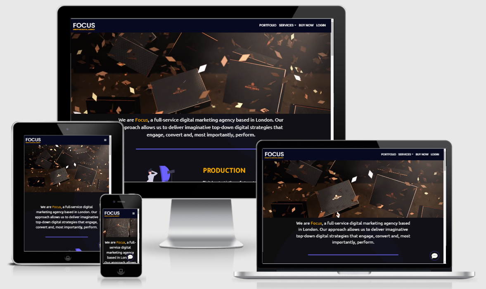

<h1 style="color:#fdad00;font-weight:700" align="center">FOCUS WEBSITE</h1>

*This is the README file for FOCUS website. You will find here a bunch of information regarding the User Experience Design, the business and users needs and the code.*

Focus is a creative digital company. They product video and photo content for digital platform. They create some marketing digital strategy for their clients and finally they can take care of the media diffusion and social media management. 

Focus Website is an application that gives the users a good understanding of what Focus is all about. 
The user will have the opportunity to see their work through a portfolio and some images/videos galleries displayed on the website.  
The users must understand what Focus is about in the first few seconds after they arrived on the website.

The main goal during the user’s visit is for they to contact the company. TO reach this goal the website is implatemented with some contact links, contant form, call-to-action buton etc.

The website have all the information the users need with a minimal design, easy to understand and easy to navigate.

[Check out the webste here.](https://###)

<h1 style="color:#fdad00;font-weight:500">User Experience</h1>

* <h2 style="color:#6c63ff;font-weight:600">Business needs</h2>
        
        lorem lipsum blablaba

* <h2 style="color:#6c63ff;font-weight:600">User's needs</h2>
        
        lorem lipsmun blabalba

* <h2 style="color:#6c63ff;font-weight:600">Website requirements</h2>
        
        llorem lipsum blablabal

* <h2 style="color:#6c63ff;font-weight:600">Website Structure</h2>
        
        lorem lispum blablablab

* <h2 style="color:#6c63ff;font-weight:600">Usage Scenario</h2>
        
        lorem lispum vkavka

<h1 style="color:#fdad00;font-weight:500">Design</h1>

* <h2 style="color:#6c63ff;font-weight:600">Wireframes</h2>

        The mains colors used on the website are dark blue and yellow

* <h2 style="color:#6c63ff;font-weight:600">Colors</h2>

        The mains colors used on the website are dark blue and yellow

* <h2 style="color:#6c63ff;font-weight:600">Typography</h2>

        The mains colors used on the website are dark blue and yellow

* <h2 style="color:#6c63ff;font-weight:600">Illustrations/Media</h2>

        The mains colors used on the website are dark blue and yellow

<h1 style="color:#fdad00;font-weight:500">Technologies</h1>

      - HTML
      - CSS
      - BOOTSTRAP

<h1 style="color:#fdad00;font-weight:500">Features</h1>

    lorem lipusm blablablabalblb

<h1 style="color:#fdad00;font-weight:500">Testing</h1>

    lorem lipsum blabalbalbalb

<h1 style="color:#fdad00;font-weight:500">Credits</h1>

    lorem lipusm blabalbalab